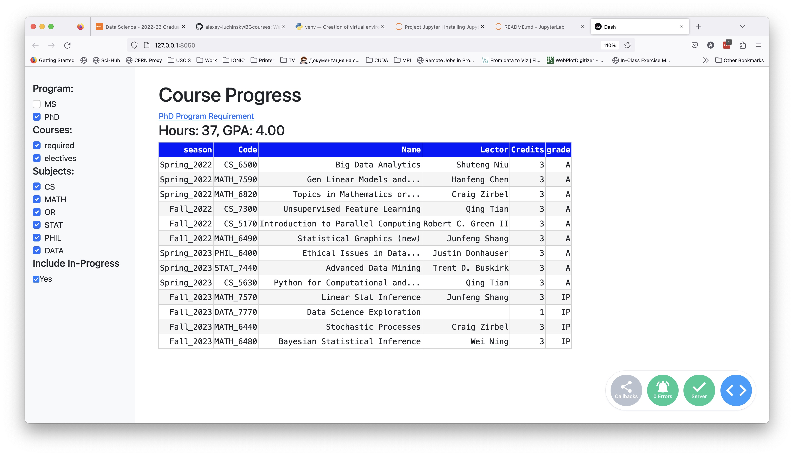

# BGcourses
Python Web app to track my BG courses

## Files

* data/
    * BG_SSR_TSRPT.pdf: unoffician transcript from myBGSU
    * corses_list.csv: required lists, taken from https://www.bgsu.edu/graduate/catalogs-and-policies/graduate-catalog/data-science.html
    * long_list_raw.csv: data about my courses (in long format), created by python/courses_progress.ipynb
* python/
    * courses_progress.ipynb: creates data/long_list_raw.csv from data/corses_list.csv and some info collected from data/BG_SSR_TSRPT.pdf and myBGSU
    * python/dash1.py: code for python web application

## How to Run

First install all the python packages.

To start the python dashboard you should simply run from the root directory of the repository the command

    > python python/dash1.py 
    
and open http://127.0.0.1:8050/ url on your browser

Here is the screenshot of the page, that you will see.

From this page it is clear, that up to now I have 37 credit hours of courses taken with GPA of 4.00. In the table on the right paane you can also see some info about these courses. You can also play with checkboxes on the left pane and see, how the information on the right pane chaanges